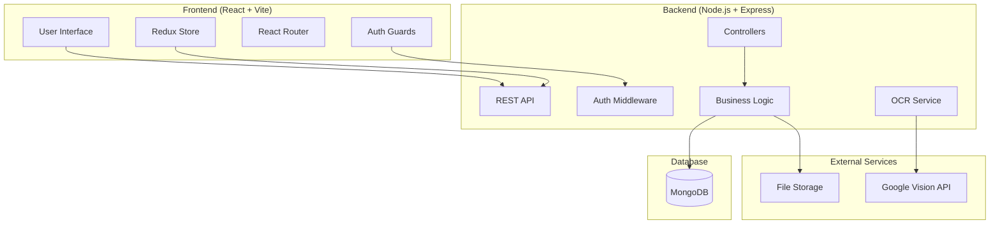

# Design Document

## Overview

The Business Billing Software is a full-stack web application designed for small item-selling businesses. The system provides comprehensive billing management with AI-powered OCR capabilities, role-based access control, and business analytics. The architecture follows a modern microservices approach with clear separation between frontend and backend concerns.

The solution consists of two separate Vite projects: a React-based frontend and a Node.js backend, connected through RESTful APIs. The system supports two distinct user roles (User and Admin) with different access levels and capabilities.

## Architecture

### High-Level Architecture



### Technology Stack

**Frontend:**
- React 18 with Vite for fast development and building
- Material-UI (MUI) for component library
- Tailwind CSS for utility-first styling
- Redux Toolkit for state management with RTK Query
- React Router v6 for client-side routing
- Axios for HTTP client with interceptors

**Backend:**
- Node.js with Express.js framework
- MongoDB with Mongoose ODM
- JWT for authentication and authorization
- Multer for file upload handling
- Google Vision API for OCR processing
- bcryptjs for password hashing
- express-rate-limit for API protection

### Project Structure

**Frontend Structure:**
```
frontend/
├── src/
│   ├── components/
│   │   ├── common/
│   │   ├── auth/
│   │   ├── client/
│   │   ├── bill/
│   │   └── admin/
│   ├── pages/
│   │   ├── auth/
│   │   ├── dashboard/
│   │   ├── clients/
│   │   ├── bills/
│   │   └── admin/
│   ├── store/
│   │   ├── slices/
│   │   └── api/
│   ├── hooks/
│   ├── utils/
│   ├── guards/
│   └── styles/
├── public/
└── package.json
```

**Backend Structure:**
```
backend/
├── src/
│   ├── controllers/
│   ├── middleware/
│   ├── models/
│   ├── routes/
│   ├── services/
│   ├── utils/
│   └── config/
├── uploads/
├── .env
└── package.json
```

## Components and Interfaces

### Frontend Components

#### Authentication Components
- **LoginForm**: Handles user login with email/password validation
- **RegisterForm**: User registration with role assignment
- **AuthGuard**: Route protection based on authentication status
- **RoleGuard**: Route protection based on user roles

#### Client Management Components
- **ClientForm**: Form for adding/editing client information
- **DocumentUpload**: File upload component with OCR integration
- **ClientList**: Display clients with search and filter capabilities
- **ClientCard**: Individual client information display

#### Bill Management Components
- **BillForm**: Multi-item bill creation with calculations
- **ItemRow**: Individual bill item with quantity/price inputs
- **BillList**: Display bills with sorting and filtering
- **BillPreview**: Print-ready bill format

#### Admin Components
- **Dashboard**: Analytics overview with charts and metrics
- **UserManagement**: User list and role management
- **ReportsView**: Sales reports and analytics

### Backend API Interfaces

#### Authentication Endpoints
```typescript
POST /api/auth/login
POST /api/auth/register
POST /api/auth/refresh
GET /api/auth/profile
```

#### Client Management Endpoints
```typescript
GET /api/clients
POST /api/clients
GET /api/clients/:id
PUT /api/clients/:id
DELETE /api/clients/:id
POST /api/clients/:id/documents
```

#### Bill Management Endpoints
```typescript
GET /api/bills
POST /api/bills
GET /api/bills/:id
PUT /api/bills/:id
DELETE /api/bills/:id
GET /api/bills/user/:userId
```

#### OCR Processing Endpoints
```typescript
POST /api/ocr/aadhaar
POST /api/ocr/pan
GET /api/ocr/status/:jobId
```

#### Admin Endpoints
```typescript
GET /api/admin/dashboard
GET /api/admin/users
GET /api/admin/reports
PUT /api/admin/users/:id/role
```

## Data Models

### User Schema
```javascript
{
  _id: ObjectId,
  email: String (unique, required),
  password: String (hashed, required),
  firstName: String (required),
  lastName: String (required),
  role: String (enum: ['User', 'Admin'], default: 'User'),
  isActive: Boolean (default: true),
  createdAt: Date,
  updatedAt: Date
}
```

### Client Schema
```javascript
{
  _id: ObjectId,
  clientName: String (required),
  fatherName: String (required),
  dateOfBirth: Date,
  gender: String (enum: ['Male', 'Female', 'Other']),
  panNumber: String (unique),
  aadhaarNumber: String,
  phoneNumber: String,
  address: String,
  documents: {
    aadhaarCard: String (file path),
    panCard: String (file path),
    photo: String (file path)
  },
  createdBy: ObjectId (ref: 'User', required),
  createdAt: Date,
  updatedAt: Date
}
```

### Bill Schema
```javascript
{
  _id: ObjectId,
  billNumber: String (unique, auto-generated),
  client: ObjectId (ref: 'Client', required),
  items: [{
    itemName: String (required),
    quantity: Number (required, min: 1),
    unitPrice: Number (required, min: 0),
    totalPrice: Number (calculated)
  }],
  subtotal: Number (calculated),
  tax: Number (default: 0),
  discount: Number (default: 0),
  totalAmount: Number (calculated),
  status: String (enum: ['Draft', 'Sent', 'Paid'], default: 'Draft'),
  createdBy: ObjectId (ref: 'User', required),
  createdAt: Date,
  updatedAt: Date
}
```

### OCR Job Schema
```javascript
{
  _id: ObjectId,
  jobId: String (unique),
  documentType: String (enum: ['aadhaar', 'pan']),
  filePath: String,
  status: String (enum: ['Processing', 'Completed', 'Failed']),
  extractedData: Object,
  error: String,
  createdBy: ObjectId (ref: 'User'),
  createdAt: Date,
  completedAt: Date
}
```

## Authentication and Authorization

### JWT Implementation
- **Access Tokens**: Short-lived (15 minutes) for API access
- **Refresh Tokens**: Long-lived (7 days) for token renewal
- **Token Storage**: HttpOnly cookies for security
- **Token Validation**: Middleware validates tokens on protected routes

### Role-Based Access Control
```javascript
// Middleware implementation
const authorize = (roles) => {
  return (req, res, next) => {
    if (!roles.includes(req.user.role)) {
      return res.status(403).json({ message: 'Access denied' });
    }
    next();
  };
};

// Usage examples
router.get('/admin/dashboard', authenticate, authorize(['Admin']), getDashboard);
router.get('/clients', authenticate, authorize(['User', 'Admin']), getClients);
```

### Data Isolation
- **User Role**: Queries filtered by `createdBy` field
- **Admin Role**: Full access to all data
- **Middleware**: Automatic filtering based on user role

## OCR Service Integration

### Google Vision API Integration
```javascript
class OCRService {
  async processAadhaar(imagePath) {
    const client = new vision.ImageAnnotatorClient();
    const [result] = await client.textDetection(imagePath);
    
    return {
      name: this.extractName(result),
      dateOfBirth: this.extractDOB(result),
      gender: this.extractGender(result),
      aadhaarNumber: this.extractAadhaarNumber(result)
    };
  }
  
  async processPAN(imagePath) {
    const client = new vision.ImageAnnotatorClient();
    const [result] = await client.textDetection(imagePath);
    
    return {
      name: this.extractName(result),
      panNumber: this.extractPANNumber(result),
      fatherName: this.extractFatherName(result)
    };
  }
}
```

### Document Processing Flow
1. **Upload**: Frontend uploads document to backend
2. **Storage**: Backend stores file securely
3. **OCR Processing**: Async processing with Google Vision API
4. **Data Extraction**: Parse and validate extracted information
5. **Response**: Return structured data to frontend
6. **Auto-fill**: Frontend populates form fields

## Redux Store Architecture

### Store Structure
```javascript
// store/index.js
export const store = configureStore({
  reducer: {
    auth: authSlice.reducer,
    clients: clientsSlice.reducer,
    bills: billsSlice.reducer,
    admin: adminSlice.reducer,
    ui: uiSlice.reducer,
    api: apiSlice.reducer
  },
  middleware: (getDefaultMiddleware) =>
    getDefaultMiddleware().concat(apiSlice.middleware)
});
```

### Auth Slice
```javascript
const authSlice = createSlice({
  name: 'auth',
  initialState: {
    user: null,
    token: null,
    isAuthenticated: false,
    loading: false,
    error: null
  },
  reducers: {
    loginStart: (state) => { state.loading = true; },
    loginSuccess: (state, action) => {
      state.user = action.payload.user;
      state.token = action.payload.token;
      state.isAuthenticated = true;
      state.loading = false;
    },
    logout: (state) => {
      state.user = null;
      state.token = null;
      state.isAuthenticated = false;
    }
  }
});
```

### API Slice with RTK Query
```javascript
export const apiSlice = createApi({
  reducerPath: 'api',
  baseQuery: fetchBaseQuery({
    baseUrl: '/api',
    prepareHeaders: (headers, { getState }) => {
      const token = getState().auth.token;
      if (token) {
        headers.set('authorization', `Bearer ${token}`);
      }
      return headers;
    }
  }),
  tagTypes: ['User', 'Client', 'Bill'],
  endpoints: (builder) => ({
    getClients: builder.query({
      query: () => '/clients',
      providesTags: ['Client']
    }),
    createClient: builder.mutation({
      query: (client) => ({
        url: '/clients',
        method: 'POST',
        body: client
      }),
      invalidatesTags: ['Client']
    })
  })
});
```

## File Upload and Storage

### Multer Configuration
```javascript
const storage = multer.diskStorage({
  destination: (req, file, cb) => {
    const uploadPath = path.join(__dirname, '../uploads', file.fieldname);
    fs.mkdirSync(uploadPath, { recursive: true });
    cb(null, uploadPath);
  },
  filename: (req, file, cb) => {
    const uniqueName = `${Date.now()}-${Math.round(Math.random() * 1E9)}${path.extname(file.originalname)}`;
    cb(null, uniqueName);
  }
});

const upload = multer({
  storage,
  limits: { fileSize: 5 * 1024 * 1024 }, // 5MB
  fileFilter: (req, file, cb) => {
    const allowedTypes = /jpeg|jpg|png|pdf/;
    const extname = allowedTypes.test(path.extname(file.originalname).toLowerCase());
    const mimetype = allowedTypes.test(file.mimetype);
    
    if (mimetype && extname) {
      return cb(null, true);
    } else {
      cb(new Error('Only image and PDF files are allowed'));
    }
  }
});
```

## Error Handling

### Global Error Handler
```javascript
const errorHandler = (err, req, res, next) => {
  let error = { ...err };
  error.message = err.message;

  // Log error
  console.error(err);

  // Mongoose bad ObjectId
  if (err.name === 'CastError') {
    const message = 'Resource not found';
    error = { message, statusCode: 404 };
  }

  // Mongoose duplicate key
  if (err.code === 11000) {
    const message = 'Duplicate field value entered';
    error = { message, statusCode: 400 };
  }

  // Mongoose validation error
  if (err.name === 'ValidationError') {
    const message = Object.values(err.errors).map(val => val.message);
    error = { message, statusCode: 400 };
  }

  res.status(error.statusCode || 500).json({
    success: false,
    error: error.message || 'Server Error'
  });
};
```

### Frontend Error Handling
```javascript
// Error boundary component
class ErrorBoundary extends React.Component {
  constructor(props) {
    super(props);
    this.state = { hasError: false };
  }

  static getDerivedStateFromError(error) {
    return { hasError: true };
  }

  componentDidCatch(error, errorInfo) {
    console.error('Error caught by boundary:', error, errorInfo);
  }

  render() {
    if (this.state.hasError) {
      return <ErrorFallback />;
    }
    return this.props.children;
  }
}
```

## Security Measures

### Input Validation
```javascript
// Using Joi for validation
const clientValidation = Joi.object({
  clientName: Joi.string().min(2).max(50).required(),
  fatherName: Joi.string().min(2).max(50).required(),
  panNumber: Joi.string().pattern(/^[A-Z]{5}[0-9]{4}[A-Z]{1}$/),
  phoneNumber: Joi.string().pattern(/^[0-9]{10}$/)
});
```

### Rate Limiting
```javascript
const rateLimit = require('express-rate-limit');

const authLimiter = rateLimit({
  windowMs: 15 * 60 * 1000, // 15 minutes
  max: 5, // limit each IP to 5 requests per windowMs
  message: 'Too many login attempts, please try again later'
});

app.use('/api/auth', authLimiter);
```

### CORS Configuration
```javascript
const corsOptions = {
  origin: process.env.FRONTEND_URL,
  credentials: true,
  optionsSuccessStatus: 200
};

app.use(cors(corsOptions));
```

Now I need to use the prework tool to analyze the acceptance criteria before writing the Correctness Properties section.
## Correctness Properties

*A property is a characteristic or behavior that should hold true across all valid executions of a system—essentially, a formal statement about what the system should do. Properties serve as the bridge between human-readable specifications and machine-verifiable correctness guarantees.*

### Property 1: Authentication Token Management
*For any* valid user credentials, authentication should return a valid JWT token, and for any invalid credentials, authentication should be rejected with appropriate error messages. Expired tokens should require re-authentication.
**Validates: Requirements 1.1, 1.2, 1.4, 8.1**

### Property 2: Role-Based Data Isolation
*For any* user with User role, data queries should only return records created by that user, while any user with Admin role should have access to all system data regardless of creator.
**Validates: Requirements 1.5, 1.6, 1.7, 3.7, 4.7, 4.8, 5.7, 7.7**

### Property 3: OCR Document Processing
*For any* valid Aadhaar card image, OCR should extract name, date of birth, and gender information, and for any valid PAN card image, OCR should extract name and PAN number information. Extracted data should auto-populate corresponding form fields.
**Validates: Requirements 2.1, 2.2, 2.3, 10.3**

### Property 4: OCR Error Handling
*For any* OCR processing failure or invalid document format, the system should allow manual data entry and display appropriate error messages while handling API failures with retry logic.
**Validates: Requirements 2.4, 10.2, 10.4**

### Property 5: File Upload Validation
*For any* file upload, the system should validate file types and sizes, accepting only supported formats (JPEG, PNG, PDF) and rejecting invalid files with appropriate error messages.
**Validates: Requirements 2.5, 6.3, 8.5**

### Property 6: Client Management Integrity
*For any* client creation attempt, the system should require mandatory fields (client name, father name) and prevent duplicate clients based on PAN number uniqueness while properly associating clients with their creators.
**Validates: Requirements 3.1, 3.5, 3.6**

### Property 7: Document Storage and Processing
*For any* document upload (Aadhaar, PAN, or photo), the system should store the document securely and trigger appropriate OCR processing when applicable.
**Validates: Requirements 3.2, 3.3, 3.4**

### Property 8: Bill Calculation Accuracy
*For any* bill with multiple items, the system should correctly calculate line totals (quantity × unit price) and the total bill amount should equal the sum of all line totals.
**Validates: Requirements 4.3, 4.4**

### Property 9: Bill Management Integrity
*For any* bill creation, the system should allow selection only from existing clients, generate unique bill numbers, and properly associate bills with their creators.
**Validates: Requirements 4.1, 4.5, 4.6**

### Property 10: Dashboard Analytics Accuracy
*For any* admin dashboard access, the displayed metrics (total sales, bill count, user count, user-wise sales) should accurately reflect the current system data across all users.
**Validates: Requirements 5.1, 5.2, 5.3, 5.4, 5.5, 5.6**

### Property 11: Data Security and Validation
*For any* data input, the system should validate all input data before database operations, hash passwords before storage, and implement proper access controls for file storage.
**Validates: Requirements 6.2, 6.4, 6.5**

### Property 12: Error Handling and Logging
*For any* system error (database failures, API errors, validation errors), the system should handle errors gracefully, log activities appropriately without exposing sensitive information, and return meaningful error responses.
**Validates: Requirements 6.6, 8.2, 8.3, 10.6**

### Property 13: Rate Limiting and Security
*For any* API endpoint, the system should implement rate limiting to prevent abuse and validate authentication tokens before granting access to protected resources.
**Validates: Requirements 6.7, 8.1**

### Property 14: Frontend State Management
*For any* user interface interaction, the system should display appropriate interfaces based on user roles, provide immediate feedback for form submissions, show loading indicators during data operations, and maintain authentication state across navigation.
**Validates: Requirements 7.1, 7.2, 7.3, 7.4, 7.6**

### Property 15: Database Schema Integrity
*For any* database operation, the system should enforce proper schema validation for User, Client, and Bill entities, maintain referential integrity between related entities, and handle cascading operations appropriately.
**Validates: Requirements 9.1, 9.2, 9.3, 9.4, 9.5, 9.7**

### Property 16: Backend Configuration and Logging
*For any* backend operation, the system should use environment variables for configuration, implement proper CORS configuration, and maintain request logging for debugging and monitoring.
**Validates: Requirements 8.4, 8.6, 8.7**

### Property 17: OCR Service Security and Validation
*For any* OCR processing operation, the service should authenticate securely with Google Vision API, validate extracted data format before returning results, and operate exclusively on the backend to protect API credentials.
**Validates: Requirements 10.1, 10.5, 10.7**

### Property 18: User Registration and Role Assignment
*For any* new user registration, the system should create a user account with User role by default and store all required authentication and profile information.
**Validates: Requirements 1.3**

## Error Handling

### Frontend Error Handling
- **Error Boundaries**: React error boundaries to catch and handle component errors
- **Form Validation**: Real-time validation with user-friendly error messages
- **API Error Handling**: Centralized error handling for API responses
- **Loading States**: Loading indicators and skeleton screens during data fetching
- **Retry Mechanisms**: Automatic retry for failed requests with exponential backoff

### Backend Error Handling
- **Global Error Middleware**: Centralized error handling for all routes
- **Validation Errors**: Structured validation error responses
- **Database Errors**: Graceful handling of database connection and query errors
- **File Upload Errors**: Proper handling of file upload failures and validation
- **OCR Processing Errors**: Fallback mechanisms for OCR service failures

### Error Response Format
```javascript
{
  success: false,
  error: {
    message: "User-friendly error message",
    code: "ERROR_CODE",
    details: {} // Additional error details for debugging
  }
}
```

## Testing Strategy

### Dual Testing Approach
The system will implement both unit testing and property-based testing to ensure comprehensive coverage:

**Unit Tests:**
- Specific examples and edge cases
- Integration points between components
- Error conditions and boundary cases
- Mock external dependencies (Google Vision API, database)

**Property-Based Tests:**
- Universal properties that hold for all inputs
- Comprehensive input coverage through randomization
- Minimum 100 iterations per property test
- Each test tagged with corresponding design property

### Property-Based Testing Configuration
- **Library**: Use `fast-check` for JavaScript/TypeScript property-based testing
- **Test Configuration**: Minimum 100 iterations per property test
- **Tagging Format**: Each test tagged as **Feature: business-billing-software, Property {number}: {property_text}**
- **Coverage**: Each correctness property implemented by a single property-based test

### Testing Framework Setup
**Frontend Testing:**
- Jest + React Testing Library for unit tests
- fast-check for property-based tests
- MSW (Mock Service Worker) for API mocking
- Cypress for end-to-end testing

**Backend Testing:**
- Jest for unit and integration tests
- fast-check for property-based tests
- Supertest for API testing
- MongoDB Memory Server for database testing

### Test Organization
```
tests/
├── unit/
│   ├── components/
│   ├── services/
│   └── utils/
├── integration/
│   ├── api/
│   └── database/
├── property/
│   ├── auth.property.test.js
│   ├── billing.property.test.js
│   └── ocr.property.test.js
└── e2e/
    ├── user-flows/
    └── admin-flows/
```

### Property Test Examples
```javascript
// Example property test for bill calculations
describe('Property 8: Bill Calculation Accuracy', () => {
  it('should correctly calculate line totals and bill totals', () => {
    fc.assert(fc.property(
      fc.array(fc.record({
        quantity: fc.integer({ min: 1, max: 100 }),
        unitPrice: fc.float({ min: 0.01, max: 1000 })
      }), { minLength: 1, maxLength: 10 }),
      (items) => {
        const bill = createBill(items);
        const expectedTotal = items.reduce((sum, item) => 
          sum + (item.quantity * item.unitPrice), 0);
        
        expect(bill.totalAmount).toBeCloseTo(expectedTotal, 2);
        
        items.forEach((item, index) => {
          expect(bill.items[index].totalPrice)
            .toBeCloseTo(item.quantity * item.unitPrice, 2);
        });
      }
    ));
  });
});
```

### Testing Coverage Goals
- **Unit Tests**: 90% code coverage
- **Property Tests**: 100% property coverage (all 18 properties tested)
- **Integration Tests**: All API endpoints and database operations
- **E2E Tests**: Critical user journeys for both User and Admin roles